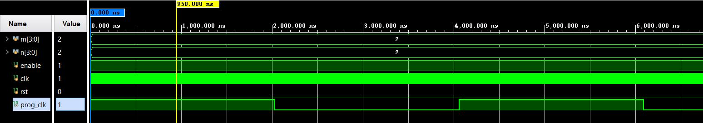
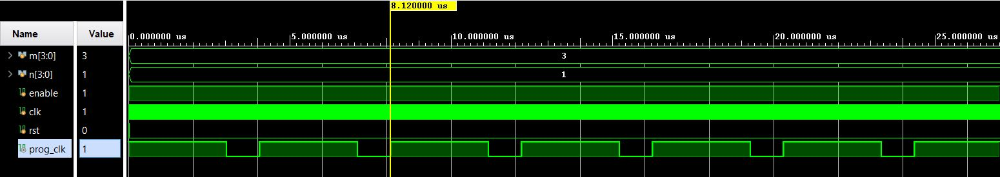

<h2>ProgSqrWavGen</h2>

<h3>Introduction</h3>
This is a progrmmable square wave generator. The code is developed for customizable ON and OFF durations.

<h3>Simulation</h3>

50% dutycycle

75% dutycyle

